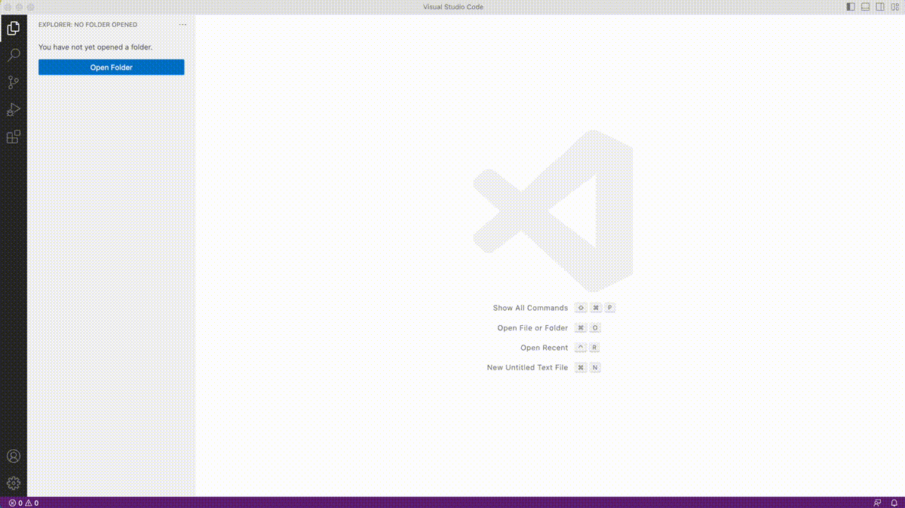
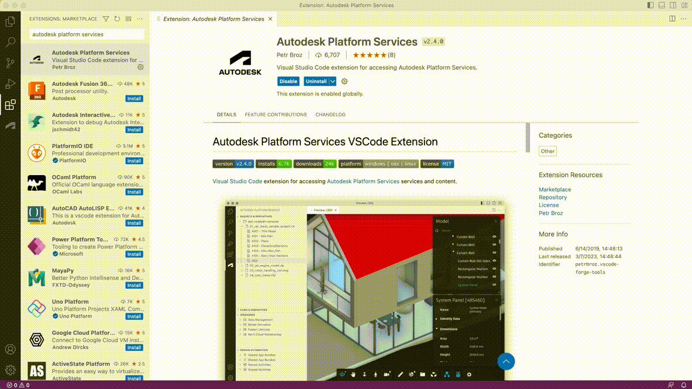
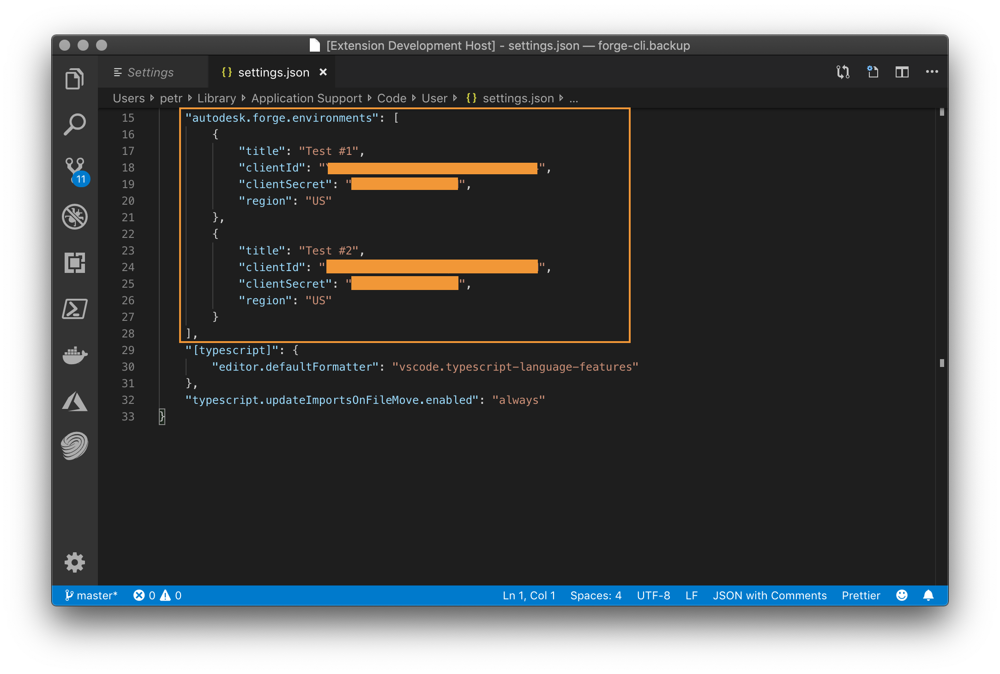
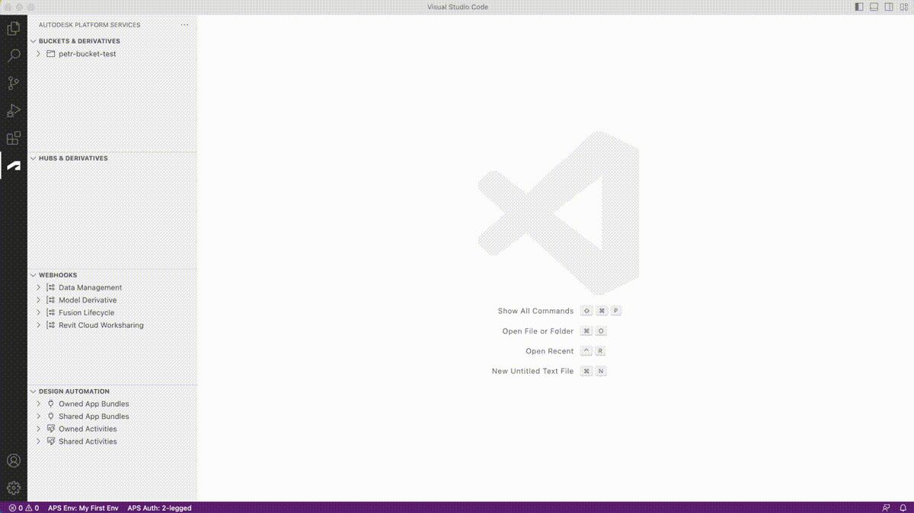
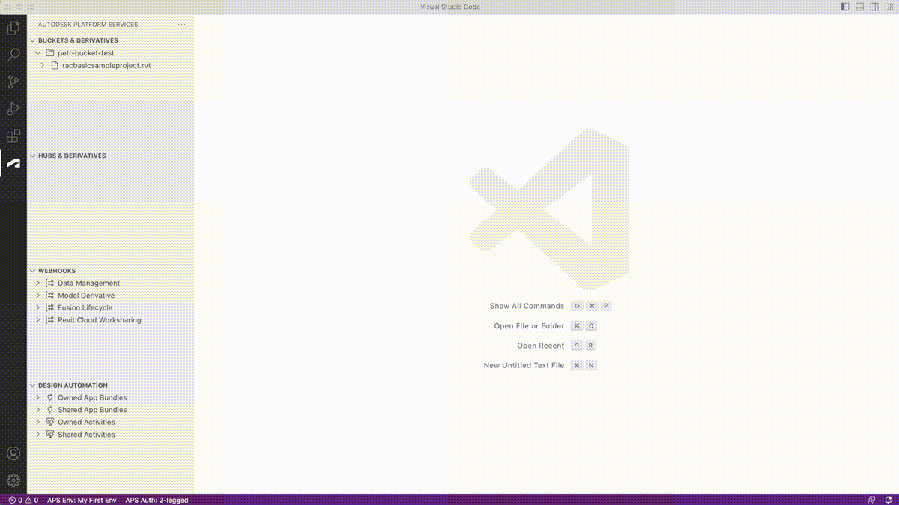

# Autodesk Platform Services (VSCode Extension)

[Visual Studio Code](https://code.visualstudio.com) extension for accessing [Autodesk Platform Services](https://aps.autodesk.com) services and content.

> Note: [Autodesk Forge is now Autodesk Platform Services](https://aps.autodesk.com/blog/autodesk-forge-becoming-autodesk-platform-services) but you may still see the _Forge_ brand used in different areas of this extension. These references have been kept to maintain backwards compatibility.

## Requirements

- [Visual Studio Code](https://code.visualstudio.com) version 1.92.0 or newer
- APS app credentials ([tutorial](https://aps.autodesk.com/en/docs/oauth/v2/tutorials/create-app))

## Installation

While in Visual Studio Code:

1. Switch to the _Extensions_ sidebar (`Cmd`+`Shift`+`X` on macOS or `Ctrl`+`Shift`+`X` on Windows), search for the _Autodesk Platform Services_ extension, and install it.

2. When you activate the _Autodesk Platform Services_ extension for the first time, it'll guide you through creating your first "environment". An environment is basically a configuration for a specific APS application, including its client ID and secret, or region, for example.

> You can configure additional environments or update existing ones by going to _User Settings_ (`Cmd`+`,` on macOS or `Ctrl`+`,` on Windows), searching for _autodesk environments_, clicking the _Edit in settings.json_ link, and modifying the JSON settings manually. Switch to _User_ or _Workspace_ tab depending on whether you want to persist the settings globally (for all instances of the editor) or locally (only for a specific workspace).

## Extension Settings

The extension exposes the following settings:

- `autodesk.forge.environments` - array of objects representing different APS applications or "environments"; each environment can specify the following properties:
  - `title` (required) - unique name of the environment (will be shown in the status bar and listed when switching between other environments)
  - `clientId` (required) - APS client ID
  - `clientSecret` (required) - APS client secret
  - `region` - data region for storing design data; can be `US` (default), `EMEA`, `AUS`, `CAN`, `DEU`, `IND`, `JPN`, or `GBR`
- `autodesk.forge.data.defaultContentType` - content type to use for all files uploaded to OSS
- `autodesk.forge.data.uploadChunkSize` - size of individual chunks (in bytes) when uploading files to OSS with the resumable functionality
- `autodesk.forge.viewer.extensions` - array of Viewer [extension](https://aps.autodesk.com/en/docs/viewer/v7/reference/Extensions) IDs (for example, `Autodesk.VisualClusters` or `Autodesk.DocumentBrowser`) to be automatically loaded when previewing derivatives
- `autodesk.forge.viewer.api` - Model Derivative API used by the viewer; by default, the viewer will determine the appropriate API based on the viewable output format (SVF vs SVF2)
- `autodesk.forge.viewer.env` - Model Derivative environment used by the viewer; by default, the viewer will determine the appropriate environment based on the viewable output format (SVF vs SVF2)

Here's an example of how the extension settings might look like in the JSON format:

## Features

### Multiple Environments

If you have configured multiple APS environments, you can switch between them via the status bar at the bottom, or using the `aps.switchEnvironment` command from the [Command Palette](https://code.visualstudio.com/docs/getstarted/userinterface#_command-palette). The extension will always initialize itself based on the _first_ environment in the list.

> Note: if you have configured the extension both in the _User_ scope and in the _Workspace_ scope, the extension will present the list of environments from the _Workspace_ scope as it has higher precedence.

### Authentication

Plain 2-legged (app) access is always available by default, and backs every "(app)" view below. Views and commands that need a user context — _Data & Derivatives (user)_, _Issues (user)_, and _Webhooks (user)_ — show a "Sign in to APS" welcome button until you're signed in; you can also sign in via the `aps.auth.login` command or the VS Code Accounts menu. Signing in offers a choice of 3-legged OAuth (confidential client), 3-legged OAuth with PKCE (public client, no secret), a Secure Service Account (sign in on behalf of a service account using its private key), or pasting an access token obtained from another APS application. Sessions are persisted per environment in VS Code's encrypted secret storage, so they survive a window reload, and 3-legged/PKCE tokens are refreshed automatically. Once signed in, use the "Logout" action in the title bar of any user-context view (or the `aps.auth.logout` command) to sign out again.

> The 3-legged OAuth flows redirect back into VS Code via a `vscode://petrbroz.vscode-forge-tools/callback` URI (resolved through `vscode.env.asExternalUri`, so it also works in remote/SSH, Codespaces, and vscode.dev). Make sure this URL - or, when working in a remote/web context, whatever URL `vscode.env.asExternalUri` resolves it to - is registered as a callback URL for your application on [https://aps.autodesk.com/myapps](https://aps.autodesk.com/myapps).

### Data & Derivatives (app) View

The _Data & Derivatives (app)_ view allows you to browse [Data Management](https://aps.autodesk.com/en/docs/data/v2/developers_guide/overview) OSS (object simple storage) content, create buckets, upload & download files, translate them using the [Model Derivative](https://aps.autodesk.com/en/docs/model-derivative/v2) service, and even preview the generated derivatives in a custom editor tab. All derivatives are listed as children of their corresponding objects in the tree. If there are no derivatives yet, or if there's been an issue with the translation, the tree view will provide additional information.

Here's some actions you can try:

1. Create a new bucket to store your designs.

> Note that bucket names must be globally unique. If you see a `409 Conflict` error, you'll need to choose a different name.

2. Upload a design to your bucket.

3. Translate the design for viewing.

4. Preview design derivatives in a new editor tab.

### Data & Derivatives (user) View

Similar to the _Data & Derivatives (app)_ view, but using a signed-in user context instead, allowing you to browse your existing design data hosted in BIM 360, ACC, and other products built with the Autodesk Platform Services. See [Authentication](#authentication) above for how to sign in.

### Issues (user) View

The _Issues (user)_ view lets you browse [ACC/BIM 360 issues](https://aps.autodesk.com/en/docs/issues/v2/developers_guide/overview/) in a hub → project → issue tree, and open a details panel for an individual issue that also lists its comments, if any. Requires the same signed-in user context as the other "(user)" views.

### Webhooks (app) and Webhooks (user) Views

The _Webhooks (app)_ and _Webhooks (user)_ views can be used to browse and manage app-owned and user-owned webhooks, respectively, in the [Webhooks](https://aps.autodesk.com/en/docs/webhooks/v1/developers_guide/overview) service, across all supported webhook systems (Data Management, Model Derivative, Cost Management, Forma Issues, Forma Reviews, Autodesk Tandem, and more).

### Design Automation (app) View

The _Design Automation (app)_ view can be used for browsing [Design Automation](https://aps.autodesk.com/en/docs/design-automation/v3/developers_guide/overview) entities such as app bundles and activities, creating and updating them, and submitting work items against an activity. It also provides a context menu that can be used to view additional details of individual bundles or activities.

### Secure Service Accounts (app) View

Manage your [Secure Service Accounts](https://aps.autodesk.com/en/docs/ssa/v1/developers_guide/overview/) and their keys through the _Secure Service Accounts (app)_ view and the context menu of individual tree items — including generating assertions and access tokens for a key — or use any commands starting with `Secure Service Accounts:`.

## Known Limitations & Issues

### Derivatives in Custom Regions, and Status Code 406

The Model Derivative service lets you store derivatives in a region of your choice. In our code we always assume that the derivatives are stored in the same region as the input object. Note that this can cause issues, for example, when you use the `Translate Object` or `Translate Object (Custom)` command on an object for which the derivatives are already available in another region. In that case you will get an error with status code 406, and you will need to delete the derivatives manually (using the `Delete Derivatives` command) before being able to translate the object again.

## Development

- clone the repository
- install and setup dependencies: `yarn install`
- open the project in vscode and launch the _Launch Extension_ task; new vscode window will open
- make sure you have at least one set of APS credentials configured (see [Getting Started](#getting-started) and [Extension Settings](##extension-settings))
- click on the APS icon in the sidebar and start browsing

> When debugging a webview inside vscode, use the `Developer: Open Webview Developer Tools` and the `Developer: Reload Window` commands.

## Troubleshooting

### Cannot Preview Re-translated Designs

VSCode seems to be caching different HTTP requests made by the viewer, and when you try and preview a design that's been re-translated, the viewer may get a cached manifest JSON that's outdated. Unfortunately the only solution I've found for this is to clear any VSCode cache: https://theblogreaders.com/visual-studio-code-tip-cleanup-cache-folder-better-performance.